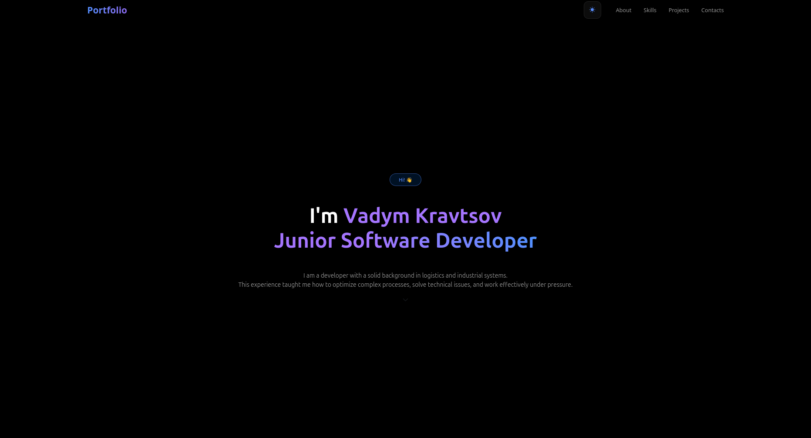
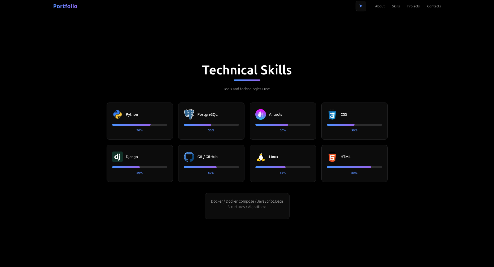

## Portfolio Website / (Django, PostgreSQL, Cloudinary, Docker Deployment)

### This is a portfolio training project to practice skills with the Django framework.

| Main Page | Projects Section |
|:---------:|:----------------:|
|  |  |

### This project implements the following:
- Profile model with user information and skill management
- Project model with image upload and project demo
- Skill model with proficiency levels and custom icons
- SkillIcon model for skill visualization
- Dynamic portfolio sections: About Us, Skills, Projects, Contacts
- Image processing using Cloudinary cloud storage
- Responsive design with light/dark theme switcher
- Integration with PostgreSQL database
- Docker containerization for deployment in productions
- Static File Management with WhiteNoise

### Start-up instructions

1. **Clone the repository:**
    ```bash
    git clone <repo-url>
    ```
    ```bash
    cd portfolio_site
    ```
    ```bash
    python -m venv .venv
    ```
    ```bash
    source .venv/bin/activate # On Windows: .venv\Scripts\activate
    ```
    ```bash
    pip install -r requirements.txt
    ```
2. **Configuration:**
    ```bash
    cp .env.example .env # Create environment variables
    ```
    ```bash
    python -c 'from django.core.management.utils import get_random_secret_key; print(get_random_secret_key())'
    # Copy the output and paste it into your .env file as the value for SECRET_KEY
    ```
3. **Apply migrations:**
   ```bash
   python manage.py migrate
   ```
4. **Create Superuser(Admin)**
   ```bash
   python manage.py createsuperuser
   ```
5. **Collect static files:**
   ```bash
   python manage.py collectstatic
   ```
6. **Run the development server:**
   ```bash
   python manage.py runserver
   ```
7. **Open in browser: Visit http://127.0.0.1:8000**

### Docker Deployment

```bash
# Build and run with Docker
docker build -t portfolio .
docker run -p 8000:8000 --env-file .env portfolio
```
